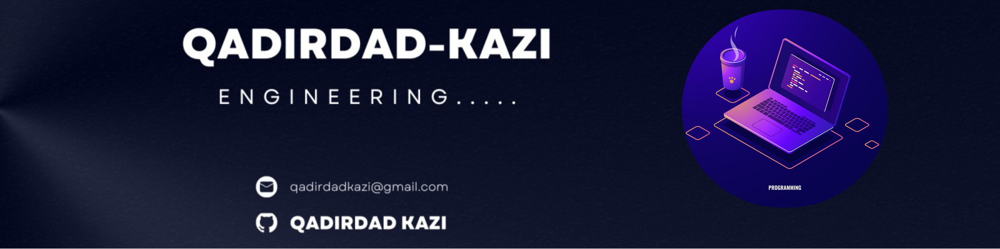

<!-- Banner Image -->

  

<h1 align="center">Hi 👋, I'm Qadirdad Kazi</h1>
<h3 align="center">A passionate Full Stack Developer from Pakistan 🇵🇰</h3>

  

 
   

---

## 👨‍💻 About Me

- 🔭 I’m currently building full-stack apps using the MERN stack + Nest.js  
- 🌟 Passionate about clean UI, fast APIs, and impactful products  
- 📚 Constantly learning and exploring new technologies  
- 💼 Open to freelance & full-time opportunities  
- 🔗 Portfolio: [qadirdadkazi.netlify.app](https://qadirdadkazi.netlify.app)

---

## 🚀 Currently Focused On

  
  <!-- Learning Card -->
  

    

      🧠
      <h3 style="margin: 0; font-size: 1.1em;">Learning</h3>
    

    
Advanced backend with <strong>Nest.js</strong> and cloud architecture

  

  <!-- Building Card -->
  

    

      🚀
      <h3 style="margin: 0; font-size: 1.1em;">Building</h3>
    

    
A <strong>financial management</strong> tool for shop owners with analytics

  

  <!-- Writing Card -->
  

    

      ✍️
      <h3 style="margin: 0; font-size: 1.1em;">Writing</h3>
    

    
Tech blog about development, tools, and best practices

  

  <!-- Community Card -->
  

    

      🤝
      <h3 style="margin: 0; font-size: 1.1em;">Community</h3>
    

    
Connecting with developers and open-source collaboration

  

---

## 🛠️ Tech Stack

### 💻 Languages

  
  
  
  
  
  

### 🖥️ Frontend

  
  
  
  
  
  

### ⚙️ Backend

  
  
  
  
  
  

### 🗃️ Databases

  
  
  
  
  

### 🛠️ Tools & Platforms

  
  
  
  
  
  
  
  

---
<!--
## ⭐ Featured Projects

- [Expense Tracker App](https://github.com/qadirdad-kazi/expense-tracker) – MERN-based income/expense tracker  
- [Portfolio Website](https://github.com/qadirdad-kazi/portfolio) – React + Framer Motion animated portfolio  
- [Financial Management Tool (WIP)](https://github.com/qadirdad-kazi/finance-tool) – Shop owner solution for tracking ledgers, expenses, and reports
---
-->
<!--
## 🏅 Certifications

- Meta Front-End Developer – Coursera  
- Responsive Web Design – freeCodeCamp  
- MongoDB Basics – MongoDB University  

---
-->
## 📊 GitHub Stats

  
  

  

---

## 📈 Contribution Activity

  

---

## 🔗 Connect With Me

  <a href="https://linkedin.com/in/qadirdad-kazi" target="_blank" style="margin: 0 8px; display: inline-flex; align-items: center; justify-content: center; width: 120px; height: 40px; border-radius: 6px; background-color: #0077B5; color: white; text-decoration: none; font-weight: 600; transition: all 0.3s ease;">
     LinkedIn
  </a>
  
  <a href="https://twitter.com/qadirdad_kazi" target="_blank" style="margin: 0 8px; display: inline-flex; align-items: center; justify-content: center; width: 120px; height: 40px; border-radius: 6px; background-color: #1DA1F2; color: white; text-decoration: none; font-weight: 600; transition: all 0.3s ease;">
     Twitter
  </a>
  
  <a href="https://github.com/qadirdad-kazi" target="_blank" style="margin: 0 8px; display: inline-flex; align-items: center; justify-content: center; width: 120px; height: 40px; border-radius: 6px; background-color: #333; color: white; text-decoration: none; font-weight: 600; transition: all 0.3s ease;">
     GitHub
  </a>
  
  <a href="https://instagram.com/qadirdad__" target="_blank" style="margin: 0 8px; display: inline-flex; align-items: center; justify-content: center; width: 120px; height: 40px; border-radius: 6px; background: linear-gradient(45deg, #405DE6, #5851DB, #833AB4, #C13584, #E1306C, #FD1D1D); color: white; text-decoration: none; font-weight: 600; transition: all 0.3s ease;">
     Instagram
  </a>
  
  <a href="mailto:qadirdadkazi@gmail.com" style="margin: 0 8px; display: inline-flex; align-items: center; justify-content: center; width: 120px; height: 40px; border-radius: 6px; background-color: #D44638; color: white; text-decoration: none; font-weight: 600; transition: all 0.3s ease;">
     Email
  </a>

  <a href="https://qadirdadkazi.netlify.app/" target="_blank" style="margin: 0 8px; display: inline-flex; align-items: center; justify-content: center; width: 200px; height: 40px; border-radius: 6px; background: linear-gradient(135deg, #00C9FF 0%, #92FE9D 100%); color: #333; text-decoration: none; font-weight: 600; transition: all 0.3s ease; box-shadow: 0 4px 15px rgba(0,0,0,0.1);">
     Visit My Portfolio
  </a>

---

## 💡 Fun Fact

  

---

  

<!--
📄 [Download My Resume](https://drive.google.com/your-resume-link)
-->

