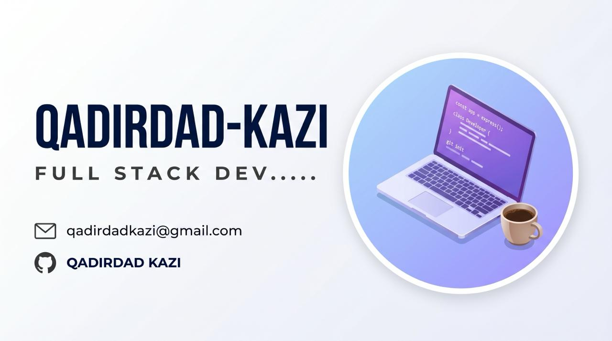

<p align="center">
  
</p>

<div align="center">
  <picture>
    <source media="(prefers-color-scheme: dark)" srcset="banner-light.jpeg">
    <source media="(prefers-color-scheme: light)" srcset="banner-dark.jpeg">
    
  </picture>
</div>

<h1 align="center">
  
</h1>

<p align="center">
  
  
  
  
</p>

<p align="center"> 
  <a href="https://qadirdadkazi.com" target="_blank">
    
  </a>
  <a href="mailto:qadirdadkazi@gmail.com">
    
  </a>
</p>

---

## 👨‍💻 About Me


```typescript
const qadirdad = {
    location: "Pakistan 🇵🇰",
    role: "Full Stack & Mobile Developer",
    technologies: {
        frontEnd: ["HTML", "CSS", "JavaScript", "React", "Tailwind CSS", "Framer Motion"],
        backEnd: ["Node.js", "Express", "NestJS", "PHP", "Laravel"],
        mobile: ["Flutter", "Android", "React Native", "iOS"],
        databases: ["MongoDB", "PostgreSQL", "SQLite", "SQL"],
        tools: ["Postman", "Cloudinary", "npm", "WordPress"]
    },
    currentFocus: ["Mobile App Development", "Cross-Platform Solutions"],
    openTo: ["Freelance Projects", "Full-Time Opportunities", "Collaborations"],
    portfolio: "qadirdadkazi.com"
};
```

<br clear="both">

### 🎯 Quick Facts

- 🔭 Currently building a **Financial Management Tool** for shop owners
- 🌱 Mastering **NestJS**, **TypeScript** and **Cloud Architecture**
- 💼 Available for **Freelance Projects** and **Full-Time Positions**
- ✍️ Writing tech articles and sharing knowledge with the community
- 🤝 Always open to interesting projects and collaborations

---

## 🎵 TRACK

<p align="center">
  <a href="https://open.spotify.com/user/qadirdadkazi" target="_blank">
    
  </a>
</p>

---

## 💼 Experience & Career Journey

<div align="center">

| 📅 Period | 💼 Role | 🛠️ Stack Highlights |
|-----------|---------|----------------------|
| **2024 – Present** | 📱 Mobile & Full Stack Developer | Flutter · React Native · Android · iOS |
| **2023 – 2024** | 🚀 MERN Stack Developer | React · Node.js · Express · MongoDB |
| **2022 – 2023** | ⚙️ Backend Developer | NestJS · PHP · Laravel · SQL |
| **2021 – 2022** | 🌐 Web Developer | HTML · CSS · JavaScript · Bootstrap |

</div>

---

<div align="center">

## 🚀 What I'm Working On

<table>
<tr>
<td width="50%" align="center">

### 📊 Current Projects
💰 **Financial Analytics Platform**<br/>
*Real-time reporting & insights for businesses*<br/><br/>
🛠️ **Open Source Contributions**<br/>
*Giving back to the community*

</td>
<td width="50%" align="center">

### 📚 Learning Journey
🎓 **Microservices Architecture**<br/>
*Building scalable distributed systems*<br/><br/>
☁️ **Cloud Technologies**<br/>
*AWS, Docker, Kubernetes*

</td>
</tr>
</table>

</div>

---

## 🛠️ Tech Stack

<p align="center">
  
</p>

<details>
<summary><b>📂 View Detailed Stack</b></summary>
<br/>

**Languages:**  
`JavaScript` • `HTML` • `CSS` • `PHP` • `SQL`

**Frontend:**  
`React.js` • `React Hook Form` • `Tailwind CSS` • `Bootstrap` • `Framer Motion` • `jQuery`

**Backend:**  
`Node.js` • `Express.js` • `Nest.js` • `Laravel`

**Mobile / Desktop:**  
`Flutter` • `React Native` • `Android` • `iOS` • `macOS` • `Windows`

**Databases:**  
`MongoDB` • `PostgreSQL` • `SQLite`

**Tools & Platforms:**  
`Postman` • `npm` • `Cloudinary` • `WordPress` • `Play Store` • `Microsoft Store` • `Apple Development`

</details>

---

## 📊 GitHub Stats

<div align="center">
  
### 📈 Performance Overview

<p align="center">
  
  
</p>

### 💻 Most Used Languages

<p align="center">
  
  
</p>

### 🏆 GitHub Trophies

<p align="center">
  
</p>

### 📊 Contribution Graph

<p align="center">
  
</p>

### 📅 Contribution Calendar

<p align="center">
  
</p>

### 🐍 Contribution Snake

<p align="center">
  <picture>
    <source media="(prefers-color-scheme: dark)" srcset="https://raw.githubusercontent.com/qadirdad-kazi/qadirdad-kazi/output/github-contribution-grid-snake-dark.svg">
    <source media="(prefers-color-scheme: light)" srcset="https://raw.githubusercontent.com/qadirdad-kazi/qadirdad-kazi/output/github-contribution-grid-snake.svg">
    
  </picture>
</p>

### 🌆 GitHub Skyline

<p align="center">
  <a href="https://skyline.github.com/qadirdad-kazi/2025" target="_blank">
    
  </a>
  &nbsp;
  <a href="https://skyline.github.com/qadirdad-kazi/2024" target="_blank">
    
  </a>
</p>

</div>

---

## ⏱️ WakaTime Coding Activity

<p align="center">
  
</p>

### 📊 This Week I Spent Time On

<!--START_SECTION:waka-->


**🐱 My GitHub Data** 

> 📦 2.5 MB Used in GitHub's Storage 
 > 
> 🏆 2,666 Contributions in the Year 2026
 > 
> 💼 Opted to Hire
 > 
> 📜 27 Public Repositories 
 > 
> 🔑 28 Private Repositories 
 > 
**I'm an Early 🐤** 

```text
🌞 Morning                0 commits           ░░░░░░░░░░░░░░░░░░░░░░░░░   00.00 % 
🌆 Daytime                0 commits           ░░░░░░░░░░░░░░░░░░░░░░░░░   00.00 % 
🌃 Evening                0 commits           ░░░░░░░░░░░░░░░░░░░░░░░░░   00.00 % 
🌙 Night                  0 commits           ░░░░░░░░░░░░░░░░░░░░░░░░░   00.00 % 
```
📅 **I'm Most Productive on Monday** 

```text
Monday                   0 commits           ░░░░░░░░░░░░░░░░░░░░░░░░░   00.00 % 
Tuesday                  0 commits           ░░░░░░░░░░░░░░░░░░░░░░░░░   00.00 % 
Wednesday                0 commits           ░░░░░░░░░░░░░░░░░░░░░░░░░   00.00 % 
Thursday                 0 commits           ░░░░░░░░░░░░░░░░░░░░░░░░░   00.00 % 
Friday                   0 commits           ░░░░░░░░░░░░░░░░░░░░░░░░░   00.00 % 
Saturday                 0 commits           ░░░░░░░░░░░░░░░░░░░░░░░░░   00.00 % 
Sunday                   0 commits           ░░░░░░░░░░░░░░░░░░░░░░░░░   00.00 % 
```


📊 **This Week I Spent My Time On** 

```text
🕑︎ Time Zone: Asia/Karachi

💬 Programming Languages: 
YAML                     25 mins             █████████████████████████   100.00 % 

🐱‍💻 Projects: 
EduGenie                 25 mins             █████████████████████████   100.00 % 

💻 Operating System: 
Windows                  25 mins             █████████████████████████   100.00 % 
```

```text

```


 Last Updated on 16/07/2026 06:44:12 UTC
<!--END_SECTION:waka-->

---


## 💡 Dev Quote

<p align="center">
  
</p>

---

## 🔗 Connect With Me

<p align="center">
  <a href="https://linkedin.com/in/qadirdad-kazi" target="_blank">
    
  </a>
  <a href="https://twitter.com/qadirdad_kazi" target="_blank">
    
  </a>
  <a href="https://instagram.com/qadirdad__" target="_blank">
    
  </a>
  <a href="mailto:qadirdadkazi@gmail.com">
    
  </a>
  <a href="https://qadirdadkazi.com" target="_blank">
    
  </a>
</p>

---

<div align="center">
  
### 💼 Open For Opportunities

<table>
<tr>
<td align="center" width="33%">
  
**💻 Freelance Projects**  
Available for web development projects

</td>
<td align="center" width="33%">
  
**🏢 Full-Time Positions**  
Seeking challenging opportunities

</td>
<td align="center" width="33%">
  
**🤝 Collaborations**  
Open to interesting partnerships

</td>
</tr>
</table>

</div>

---

<p align="center">
  
</p>

<p align="center">
  
</p>

---

<p align="center">
  <i>⭐️ From <a href="https://github.com/qadirdad-kazi">Qadirdad Kazi</a> with 💙</i>
</p>
